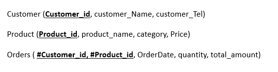
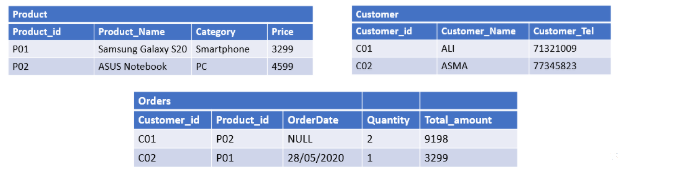

# 🛢️ DML_Checkpoint - Exercice SQL : Insertion de Données avec DML

## 📋 Description du projet

L’objectif est de **pratiquer l’insertion de données** (`INSERT INTO`) dans un modèle relationnel existant à l’aide du langage **DML (Data Manipulation Language)** de SQL.

## 🗂️ Structure du Projet

```
DML_Checkpoint/
├── Data_table.png            # Données à insérer
├── Modele_relational.png     # Schéma relationnel des tables
├── README.md                 # Documentation du projet (vous y êtes !)
└── schema.sql                # Script SQL pour les Requêtes d'insertion SQL
```

---

## 📊 Modèle Relationnel

Le modèle relationnel est composé de **trois tables** :

- **Customer** (*Customer_id*, customer_Name, customer_Tel)
- **Product** (*Product_id*, product_name, category, Price)
- **Orders** (#Customer_id, #Product_id, OrderDate, quantity, total_amount)

🧠 *Légende* :

- Les clés **primaires** sont **soulignées** (`*...*`)

- Les clés **étrangères** sont précédées d’un `#`



---

## 📝 Données à Insérer

L'objectif était d'insérer les données suivantes dans les tables correspondantes :

### 👤 Table ``Customer``

| Customer_id | customer_Name | customer_Tel |
|-------------|----------------|----------------|
| C01         | ALI            | 71321009       |
| C02         | ASMA           | 77345823       |

### 📦 Table ``Product``

| Product_id | product_name             | category   | Price |
|------------|--------------------------|------------|--------|
| P01        | Samsung Galaxy S20       | Smartphone | 3299   |
| P02        | ASUS Notebook            | PC         | 4599   |

### 📄 ``Orders``

| Customer_id | Product_id | OrderDate   | quantity | total_amount |
|-------------|------------|-------------|----------|---------------|
| C01         | P02        | `NULL`      | 2        | 9198          |
| C02         | P01        | 28/05/2020  | 1        | 3299          |



---

## 💻 Commandes SQL utilisées

```sql
-- Insertion dans la table Customer
INSERT INTO Customer (Customer_id, customer_Name, customer_Tel)
VALUES ('C01', 'ALI', '71321009');

INSERT INTO Customer (Customer_id, customer_Name, customer_Tel)
VALUES ('C02', 'ASMA', '77345823');

-- Insertion dans la table Product
INSERT INTO Product (Product_id, product_name, category, Price)
VALUES ('P01', 'Samsung Galaxy S20', 'Smartphone', 3299);

INSERT INTO Product (Product_id, product_name, category, Price)
VALUES ('P02', 'ASUS Notebook', 'PC', 4599);

-- Insertion dans la table Orders
INSERT INTO Orders (Customer_id, Product_id, OrderDate, quantity, total_amount)
VALUES ('C01', 'P02', NULL, 2, 9198);

INSERT INTO Orders (Customer_id, Product_id, OrderDate, quantity, total_amount)
VALUES ('C02', 'P01', '28/05/2020', 1, 3299);
```

---

## 🔍 Points importants

- La valeur `NULL` est utilisé pour indiquer l'absence de date dans la première commande.
- Le format de date `'28/05/2020'` peut varier selon le SGBD :
  - 📌 *MySQL / PostgreSQL préfèrent le format* `'2020-05-28'`
- `total_amount` = `Price * quantity`  
  - Exemple : 4599 × 2 = **9198**

---

## 🔧 Technologies utilisées

- SQL (Data Manipulation Language)
- Compatible avec la plupart des SGBD : **MySQL**, **PostgreSQL**, **Oracle**, **SQL Server**

## 📜 Licence

> Projet réalisé dans le cadre d'un exercice académique.  
Utilisable librement pour l’apprentissage et les projets pédagogiques 🎓.
